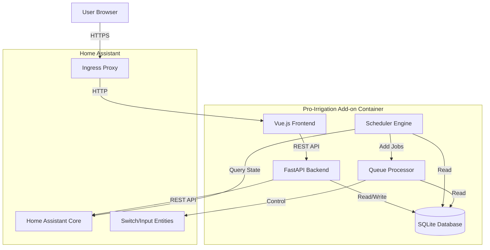
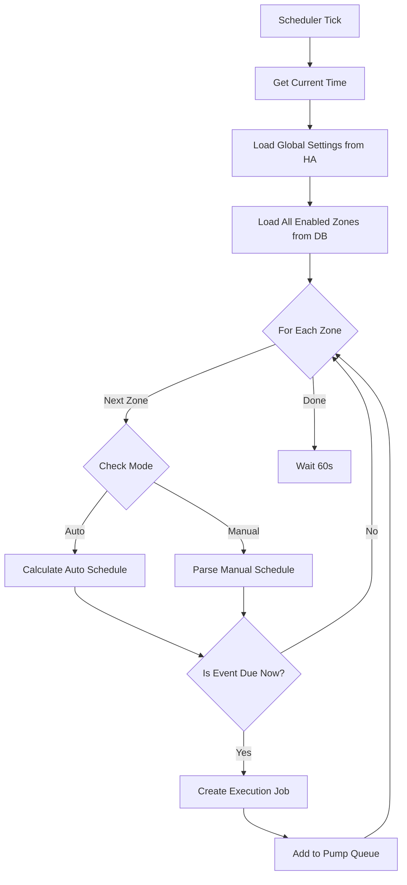
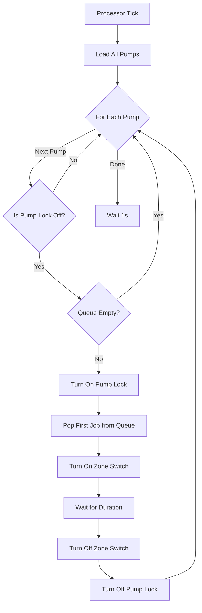
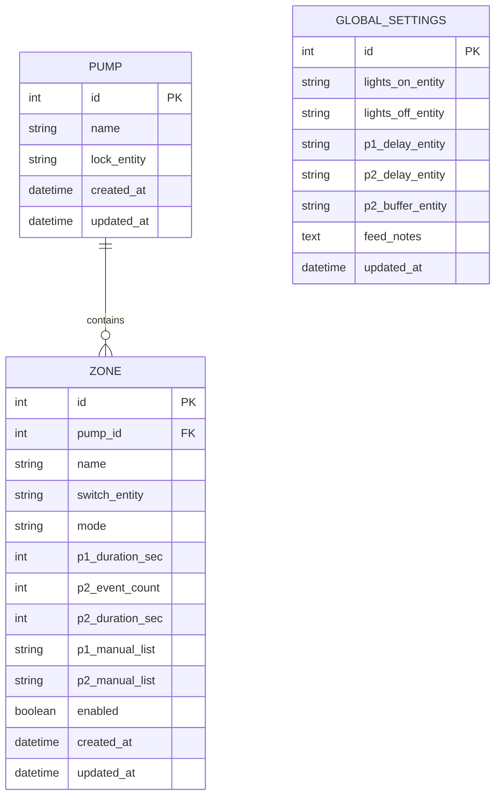

# Pro-Irrigation Add-on Design Document

## Overview

The Pro-Irrigation Add-on is a full-stack Home Assistant add-on that provides a web-based irrigation management system. The architecture consists of three main layers:

1. **Frontend Layer**: A modern single-page application (SPA) served through Home Assistant Ingress
2. **Backend Layer**: A Python-based FastAPI service that handles business logic, scheduling, and Home Assistant integration
3. **Data Layer**: A SQLite database for persistent configuration storage

The system operates as a long-running service within Home Assistant, continuously monitoring schedules and executing irrigation events through the Home Assistant API.

## Architecture

### High-Level Component Diagram



### Technology Stack

**Frontend:**
- Vue.js 3 with Composition API
- Vite for build tooling
- Axios for HTTP requests
- Vue Router for navigation
- Pinia for state management

**Backend:**
- Python 3.11+
- FastAPI for REST API
- SQLAlchemy for database ORM
- APScheduler for scheduled tasks
- aiohttp for Home Assistant API calls
- Pydantic for data validation

**Database:**
- SQLite 3 (file-based, stored in /data volume)

**Deployment:**
- Docker container
- Home Assistant Add-on configuration
- Ingress-enabled for sidebar integration

## Components and Interfaces

### 1. Frontend Application

#### Component Structure

```
src/
├── components/
│   ├── PumpCard.vue          # Individual pump display card
│   ├── ZoneListItem.vue      # Zone list entry with status
│   ├── ZoneEditor.vue        # Zone configuration form
│   ├── EntitySelector.vue    # Searchable entity dropdown
│   └── GlobalSettings.vue    # Global configuration form
├── views/
│   ├── PumpsDashboard.vue    # Main home screen
│   ├── ZoneManager.vue       # Zone list for a pump
│   └── Settings.vue          # Global settings page
├── services/
│   └── api.js                # Backend API client
├── stores/
│   └── irrigation.js         # Pinia store for state
└── router/
    └── index.js              # Vue Router configuration
```

#### Key Frontend Interfaces

**API Service (api.js)**
```javascript
class IrrigationAPI {
  // Pump operations
  async getPumps()
  async createPump(name)
  async updatePump(id, data)
  async deletePump(id)
  
  // Zone operations
  async getZones(pumpId)
  async createZone(pumpId, zoneData)
  async updateZone(id, zoneData)
  async deleteZone(id)
  
  // Entity discovery
  async getAvailableEntities(entityType)
  
  // Global settings
  async getGlobalSettings()
  async updateGlobalSettings(settings)
  
  // Status monitoring
  async getPumpStatus(pumpId)
  async getZoneNextRun(zoneId)
}
```

### 2. Backend API Service

#### REST API Endpoints

**Pump Management**
- `GET /api/pumps` - List all pumps with status
- `POST /api/pumps` - Create new pump
- `GET /api/pumps/{id}` - Get pump details
- `PUT /api/pumps/{id}` - Update pump
- `DELETE /api/pumps/{id}` - Delete pump
- `GET /api/pumps/{id}/status` - Get real-time pump status

**Zone Management**
- `GET /api/pumps/{pump_id}/zones` - List zones for pump
- `POST /api/pumps/{pump_id}/zones` - Create zone
- `GET /api/zones/{id}` - Get zone details
- `PUT /api/zones/{id}` - Update zone
- `DELETE /api/zones/{id}` - Delete zone
- `GET /api/zones/{id}/next-run` - Calculate next scheduled run

**Entity Discovery**
- `GET /api/ha/entities?type=switch` - Get Home Assistant switch entities
- `GET /api/ha/entities?type=input_datetime` - Get datetime input entities
- `GET /api/ha/entities?type=input_number` - Get number input entities
- `GET /api/ha/entities?type=input_boolean` - Get boolean input entities

**Global Settings**
- `GET /api/settings` - Get global settings
- `PUT /api/settings` - Update global settings

**System Health**
- `GET /api/health` - Health check endpoint
- `GET /api/status` - Overall system status

#### Backend Service Structure

```
backend/
├── main.py                   # FastAPI application entry
├── models/
│   ├── database.py          # SQLAlchemy models
│   └── schemas.py           # Pydantic schemas
├── services/
│   ├── ha_client.py         # Home Assistant API client
│   ├── scheduler.py         # Scheduler engine
│   ├── queue_processor.py   # Pump queue processor
│   └── calculator.py        # Schedule calculation logic
├── routers/
│   ├── pumps.py            # Pump endpoints
│   ├── zones.py            # Zone endpoints
│   ├── entities.py         # Entity discovery endpoints
│   └── settings.py         # Settings endpoints
└── config.py               # Configuration management
```

### 3. Scheduler Engine

The Scheduler Engine runs as a background task using APScheduler, executing every 60 seconds.

**Scheduler Logic Flow:**



**Auto Mode Calculation Algorithm:**

```python
def calculate_auto_schedule(zone, global_settings):
    lights_on = global_settings.lights_on_time
    lights_off = global_settings.lights_off_time
    
    # P1 Event
    p1_start = lights_on + global_settings.p1_start_delay_min
    p1_event = {
        'time': p1_start,
        'duration': zone.p1_duration_sec
    }
    
    # P2 Events
    p2_start = lights_on + global_settings.p2_start_delay_min
    p2_end = lights_off - global_settings.p2_end_buffer_min
    p2_window = p2_end - p2_start
    
    if zone.p2_event_count > 0:
        p2_spacing = p2_window / zone.p2_event_count
        p2_events = []
        for i in range(zone.p2_event_count):
            p2_events.append({
                'time': p2_start + (i * p2_spacing),
                'duration': zone.p2_duration_sec
            })
    
    return [p1_event] + p2_events
```

### 4. Pump Queue Processor

The Queue Processor runs as a separate background task, executing every 1 second.

**Queue Processor Logic Flow:**



**Queue Data Structure:**

Each pump maintains a FIFO queue of execution jobs:

```python
class ExecutionJob:
    zone_id: int
    zone_name: str
    switch_entity: str
    duration_seconds: int
    scheduled_time: datetime
    created_at: datetime
```

### 5. Home Assistant Integration Client

**HA Client Interface:**

```python
class HomeAssistantClient:
    def __init__(self, supervisor_token: str):
        self.base_url = "http://supervisor/core/api"
        self.token = supervisor_token
    
    async def get_entities(self, entity_type: str) -> List[Entity]:
        """Discover entities by type (switch, input_datetime, etc.)"""
        
    async def get_state(self, entity_id: str) -> EntityState:
        """Get current state of an entity"""
        
    async def call_service(self, domain: str, service: str, 
                          entity_id: str) -> None:
        """Call a Home Assistant service"""
        
    async def turn_on(self, entity_id: str) -> None:
        """Convenience method for switch.turn_on"""
        
    async def turn_off(self, entity_id: str) -> None:
        """Convenience method for switch.turn_off"""
```

## Data Models

### Database Schema



### SQLAlchemy Models

**Pump Model:**
```python
class Pump(Base):
    __tablename__ = "pumps"
    
    id = Column(Integer, primary_key=True)
    name = Column(String(100), nullable=False)
    lock_entity = Column(String(255), nullable=False)
    created_at = Column(DateTime, default=datetime.utcnow)
    updated_at = Column(DateTime, onupdate=datetime.utcnow)
    
    zones = relationship("Zone", back_populates="pump", cascade="all, delete-orphan")
```

**Zone Model:**
```python
class Zone(Base):
    __tablename__ = "zones"
    
    id = Column(Integer, primary_key=True)
    pump_id = Column(Integer, ForeignKey("pumps.id"), nullable=False)
    name = Column(String(100), nullable=False)
    switch_entity = Column(String(255), nullable=False)
    mode = Column(String(20), nullable=False)  # 'auto' or 'manual'
    
    # Auto mode fields
    p1_duration_sec = Column(Integer, nullable=True)
    p2_event_count = Column(Integer, nullable=True)
    p2_duration_sec = Column(Integer, nullable=True)
    
    # Manual mode fields
    p1_manual_list = Column(Text, nullable=True)  # JSON array of times
    p2_manual_list = Column(Text, nullable=True)  # JSON array of times
    
    enabled = Column(Boolean, default=True)
    created_at = Column(DateTime, default=datetime.utcnow)
    updated_at = Column(DateTime, onupdate=datetime.utcnow)
    
    pump = relationship("Pump", back_populates="zones")
```

**GlobalSettings Model:**
```python
class GlobalSettings(Base):
    __tablename__ = "global_settings"
    
    id = Column(Integer, primary_key=True)
    lights_on_entity = Column(String(255), nullable=True)
    lights_off_entity = Column(String(255), nullable=True)
    p1_delay_entity = Column(String(255), nullable=True)
    p2_delay_entity = Column(String(255), nullable=True)
    p2_buffer_entity = Column(String(255), nullable=True)
    feed_notes = Column(Text, nullable=True)
    updated_at = Column(DateTime, onupdate=datetime.utcnow)
```

### API Request/Response Schemas

**Pump Schemas:**
```python
class PumpCreate(BaseModel):
    name: str
    lock_entity: str

class PumpResponse(BaseModel):
    id: int
    name: str
    lock_entity: str
    status: str  # 'idle', 'running', 'queued'
    active_zone: Optional[str]
    queue_length: int
    created_at: datetime
```

**Zone Schemas:**
```python
class ZoneCreate(BaseModel):
    name: str
    switch_entity: str
    mode: Literal['auto', 'manual']
    p1_duration_sec: Optional[int]
    p2_event_count: Optional[int]
    p2_duration_sec: Optional[int]
    p1_manual_list: Optional[str]
    p2_manual_list: Optional[str]
    enabled: bool = True

class ZoneResponse(BaseModel):
    id: int
    pump_id: int
    name: str
    switch_entity: str
    mode: str
    next_run: Optional[datetime]
    enabled: bool
```

## Error Handling

### Frontend Error Handling

1. **API Communication Errors**: Display toast notifications for failed requests
2. **Validation Errors**: Show inline form validation messages
3. **Network Timeouts**: Implement retry logic with exponential backoff
4. **Session Expiry**: Redirect to Home Assistant login if authentication fails

### Backend Error Handling

1. **Home Assistant API Failures**: Log errors and continue operation, retry on next cycle
2. **Database Errors**: Implement transaction rollback and error logging
3. **Invalid Configuration**: Validate all inputs and return 400 Bad Request with details
4. **Entity Not Found**: Return 404 with clear error message
5. **Scheduler Exceptions**: Catch and log exceptions, continue scheduler operation

### Queue Processor Error Handling

1. **Switch Control Failure**: Log error, mark job as failed, continue to next job
2. **Pump Lock Stuck**: Implement timeout mechanism (5 minutes), force unlock and log warning
3. **Job Timeout**: If job exceeds expected duration by 2x, force stop and log error

### Error Logging Strategy

- Use Python logging module with rotating file handler
- Log levels:
  - DEBUG: Scheduler calculations, queue operations
  - INFO: Job execution, configuration changes
  - WARNING: Retry attempts, timeout warnings
  - ERROR: API failures, database errors
  - CRITICAL: System failures requiring intervention

## Testing Strategy

### Unit Tests

**Backend Unit Tests (pytest):**
- Schedule calculation logic (auto mode algorithm)
- Manual schedule parsing
- Queue management operations
- Database model operations
- API endpoint handlers

**Frontend Unit Tests (Vitest):**
- Component rendering
- Form validation logic
- API service methods
- State management (Pinia stores)

### Integration Tests

**Backend Integration Tests:**
- Full API endpoint testing with test database
- Home Assistant API client mocking
- Scheduler engine with mocked time
- Queue processor with mocked HA calls

**Frontend Integration Tests:**
- Component interaction flows
- Router navigation
- API integration with mocked backend

### End-to-End Tests

**Critical User Flows:**
1. Add pump → Add zone → Configure auto mode → Verify schedule calculation
2. Add zone with manual mode → Verify manual times parsed correctly
3. Configure global settings → Verify auto schedules update
4. Multiple zones on same pump → Verify queue ordering and pump lock
5. Zone execution → Verify switch control and timing

### Manual Testing Checklist

- [ ] Ingress integration displays correctly in HA sidebar
- [ ] Entity dropdowns populate with real HA entities
- [ ] Pump status updates in real-time
- [ ] Zone switches activate at scheduled times
- [ ] Pump lock prevents simultaneous zone execution
- [ ] Configuration persists across add-on restart
- [ ] UI responsive on mobile devices
- [ ] Error messages display appropriately

### Performance Testing

**Targets:**
- API response time: < 200ms for all endpoints
- Scheduler cycle time: < 5 seconds for 100 zones
- Queue processor latency: < 100ms per pump check
- Frontend initial load: < 2 seconds
- Database query time: < 50ms for all queries

## Deployment Configuration

### Home Assistant Add-on Configuration

**config.yaml:**
```yaml
name: Pro-Irrigation
version: 1.0.0
slug: pro-irrigation
description: Professional irrigation management system
arch:
  - aarch64
  - amd64
  - armv7
init: false
ingress: true
ingress_port: 8000
panel_icon: mdi:sprinkler-variant
startup: services
boot: auto
ports:
  8000/tcp: null
options:
  log_level: info
schema:
  log_level: list(debug|info|warning|error)
```

**Dockerfile:**
```dockerfile
FROM python:3.11-slim

# Install frontend build dependencies
RUN apt-get update && apt-get install -y nodejs npm

# Copy backend
WORKDIR /app
COPY backend/requirements.txt .
RUN pip install --no-cache-dir -r requirements.txt

# Copy and build frontend
COPY frontend /app/frontend
WORKDIR /app/frontend
RUN npm install && npm run build

# Setup application
WORKDIR /app
COPY backend /app/backend
COPY run.sh /app/

# Create data directory
RUN mkdir -p /data

EXPOSE 8000
CMD ["/app/run.sh"]
```

### Environment Variables

- `SUPERVISOR_TOKEN`: Provided by Home Assistant for API access
- `LOG_LEVEL`: Configurable logging level
- `DATABASE_PATH`: Path to SQLite database file (/data/irrigation.db)

## Security Considerations

1. **Authentication**: Rely on Home Assistant's authentication via Ingress
2. **API Access**: Use supervisor token for HA API calls (never exposed to frontend)
3. **Input Validation**: Validate all user inputs on backend
4. **SQL Injection**: Use SQLAlchemy ORM to prevent SQL injection
5. **XSS Protection**: Sanitize all user-provided text in frontend
6. **CORS**: Not needed due to Ingress proxy
7. **Rate Limiting**: Implement rate limiting on API endpoints to prevent abuse

## Future Enhancements

1. **Zone Groups**: Group multiple zones for simultaneous operation
2. **Weather Integration**: Adjust schedules based on weather conditions
3. **Historical Logging**: Track irrigation history and water usage
4. **Mobile App**: Native mobile application
5. **Advanced Scheduling**: Seasonal adjustments, soil moisture integration
6. **Notifications**: Push notifications for errors or completion
7. **Backup/Restore**: Configuration export and import
8. **Multi-language Support**: Internationalization
